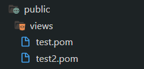

# 😺 pomJS 😺

Librería para React para permitir el uso de Web Templating

## Instalación y Uso

0. Proyecto para testear

   - Instalar Vite
     <code>npm install -g create-vite</code>
   - Crear proyecto Vite
     <code>npm create vite</code>
   - Utilizar React + JavaScript

<br>

1. Empaquetado de la librería

   - Clonar este repositorio
   - Instalar dependencia:
     <code>npm install</code>
   - En Windows completar el script <b>test.ps1.example</b> con el nombre de los directorios de la librería y del proyecto y ejecutar.
   - En Linux/Mac
     - En el directorio de librería:
       <code>npm pack</code>
     - Mover "pomjs-1.0.0.tgz" a la carpeta del proyecto.
     - En el directorio del proyecto:
       <code>npm install ./pomjs-1.0.0.tgz</code>

<br>

2.  Usar

    - Correr el proyecto Vite
      <code>npm run dev</code>
    - Crear archivos en carpeta <i>public</i> o en direcciones públicas del server

      

    - Abrir el archivo <i>App.jsx</i> o cualquier otro que represente un componente

    - Importar la librería

      ```js
      import { PomView } from "pomjs";
      ```

    - Instanciar las templates en componentes siguiendo esta sintaxis, incluyendo la dirección de la template y las variables de estado que queremos instanciar:

      ```js
      function Componente() {
        return (
          <div>
            <PomView filePath="/ruta/archivo.pom" arg1={...} arg2={...} ... />
          </div>
        );
      }
      ```

    - El resultado es una traducción a JSX de las instrucciones de la template:

      ```js
      <div>{traduccion}</div>
      ```
